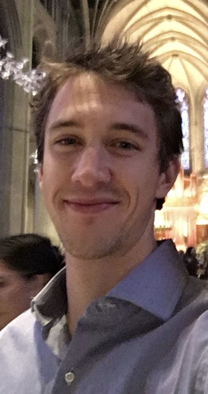

 

My name is Will Godwin. Professionally, I'm interested in research within the nexus of climate, population health and biostatistics. My work experience and interests center around analyzing multi-dimensional health data, primarily in R, preferring to comprehensively visualize data before modeling and assuming distributional forms. I currently work as a Data Scientist at University of California San Francisco, managing and analyzing data from randomized-controlled trials investigating methods to reduce child mortality. Previously, I studied and worked in Seattle within a data science fellowship through the Institute for Health Metrics and Evaluation (IHME). While there, I modeled exposure and health burden due to environmental risk factors for the [Global Burden of Disease](https://www.thelancet.com/gbd) study, while earning my Masters in Public Health  part time. The work at IHME was fast-paced and afforded me many crash courses in statistics, programming, and time management as we sought to carry out the institute's conspicuous [vision](http://www.healthdata.org/gbd/about).

Like all personal projects, this website is a work in progress and will be added to iteratively. It serves as a tool for my own growth in coding, statistics, and communicating analyses. Included are some data projects that focus on topics of interest to me including politics and the environment. As transparency and reproducibility become standard data science protocol, I use publicly available data and publish or direct readers to the underlying R code.

In my free time, I love to go for bike rides out in the [Marin Headlands](images/hawk_hill.JPG) north of San Francisco.

My resume is available [here](files/CV-WGodwin.pdf).