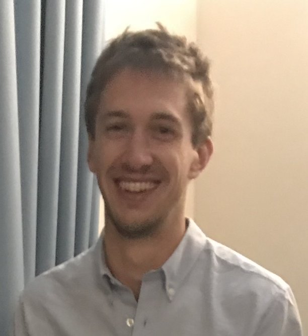

---

---

My name is Will Godwin. Professionally, I'm interested in research within the nexus of climate, health, and agriculture. I currently work as a Research Analyst at University of California San Francisco, managing and analyzing data from randomized-controlled trials investigating methods to reduce childhood mortality. Previously, I studied and worked in Seattle within a fellowship through the Institute for Health Metrics and Evaluation. While there, I graduated with a Masters in Public Health and spent 3 years modeling exposure and health burden due to environmental risk factors for the [Global Burden of Disease](https://www.thelancet.com/gbd) study. My MPH coursework and work experience at IHME was statistical in nature and afforded me a focused space to hone my quantitative and programming abilities.

Like all personal projects, this website is a work in progress and will be added to iteratively. It serves as a tool for my own growth in writing, coding, and statistics. Included are some data projects centered on topics that interest me including politics and the environment. In the spirit of transparency and reproducibility I use publicly available data and publish or direct readers to the underlying R code since I've benefitted immensely from members of the R/stats community publishing their code and explaining their methods. Plus, as a scientific principle, any researcher should strive for transparency and reproducibility when possible. I'll steadily add more small projects and analyses as I complete them.

When I'm not working, I love to go for bike rides out in the [Marin Headlands](images/hawk_hill.JPG) north of San Francisco.

My resume is available [here](files/CV-WGodwin.pdf).