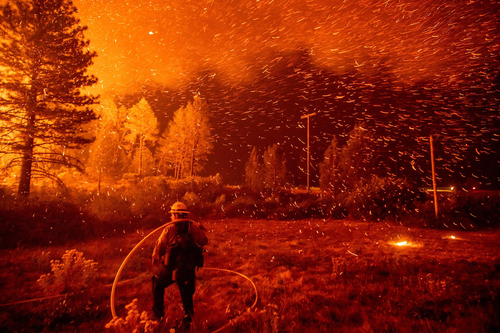

---

---

<link rel="stylesheet" href="styles.css" type="text/css">

## Political Ad Spending on Google Platforms

\vspace{3em}

[Geographic Distribution Part 1-U.S level](map_ads_us.html)

\vspace{2em}

[Geographic Distribution Part 2-State level](map_ads_state.html)

\vspace{3em}

[Modeling Impressions (Ad views)](impressions_model.html)

\vspace{3em}

[RShiny visualization showing time series of spending](https://wgodwin28.shinyapps.io/shiny_google_political_ads/)

\vspace{3em}

\vspace{3em}

$~$

## United States Wildfires 1992-2015

\vspace{3em}

[Mapping the Most Destructive California Wildfires of 2015](ca_fires_map.html)

\vspace{3em}

[Wildfire Cartograms in U.S.](fires_cartogram.html)

\vspace{3em}

[Wildfire Time Series Decomp](fires_time_series.html)

credit: National Geographic

$~$

## Miscellaneous

[Homemade Permutation Test on Simulated Cycling Data](permutation_hand.html)
